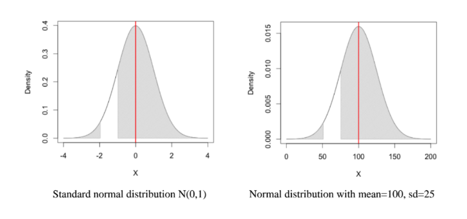

# Working with Normal distribution

Data File
    - [californiatod.csv](californiatod.csv)

    
```{r}
#install.packages(readr)
library(readr)
library(dplyr)
californiatod <- read_csv("californiatod.csv")
```    

## Calculate z-scores

We will calculate z-scores using the formula. In order to do so we will use R just as we would use a spreadsheet, creating new variables as we go, and then applying the formula using the new variables we've created along the way.

The z-score for each individual observation of a variable is computed in a similar fashion: the **value for that observation** *minus* a constant (the variable's mean), and then *divided by* **another constant** (the variable's standard deviation).

This is the z-score formula we just described above:

$$z = \frac{x - \bar{x}}{s}$$

For our variable "density", which lists the density for each TOD site, you could create a new variable in R called "z_density" which would contain the z-score for the density variable. We would use this formula:

```{r}

californiatod$z_density <- (californiatod$density - mean(californiatod$density))/sd(californiatod$density)

californiatod %>% print()
```

Remember that **mean(Dataset\$varname)** and **sd(Dataset\$varname)** give you the mean and standard deviation of a variable (varname).

## Calculate the Shaded Area with the pnorm function

To get the probability of following a certain (e.g. normal) distribution, we use the distribution function with the prefix *p*. For example, for a normal distribution, we use `pnorm(x, mean, sd)`, which gives us the probability up to the value of x. 



 
```{r}
# shaded area on the left
pnorm(-2)

# shaded area on the right
(1 - pnorm(-1))

# put together
pnorm(-2) + (1 - pnorm(-1))


## equivalent to

pnorm(50, mean=100, sd=25) + (1 - pnorm(75, mean=100, sd=25))
```

# Data Wrangling with R

In this lab we will be introduced to the beginning of our R workflow. This will include covering the basics of importing data, variable manipulation, and saving our results in various formats for later use.

Data File

- [eb_pums_2000.RDS](eb_pums_2000.rds)
- [Rmarkdown file](lab03.Rmd)

Packages

- dplyr, [cheatsheet](https://www.rstudio.com/wp-content/uploads/2015/02/data-wrangling-cheatsheet.pdf)


**Load .RDs file** .RDS files are files that save individual objectsin one's global environment at the time of saving. We do not need to cover all of the intricacies of differing environments (a treatment of the advantages of RDS files versus slightly more common RDA files can be found [here](http://www.fromthebottomoftheheap.net/2012/04/01/saving-and-loading-r-objects/)), but do know that .RDS files are a data type built for R and you do not need to have any additional packages to load them and the syntax is straightforward. Because they are built for R they also load a lot faster than trying to import some other form of tabular data because R does not have to work out differing column types or other related issues.


*Note:* I also loaded the *pander* package. This is for display purposes for the lab

```{r, echo=TRUE, message=FALSE, warning=FALSE}
#remember to begin by opening your RStudio project and save the data file to your project directory

if(!require(pacman)){install.packages("pacman"); library(pacman)}
p_load(dplyr, pander)

eb_pums <- readRDS("eb_pums_2000.rds")

#Note: you do not need to have the full file path if you have properly set up your RStudio project, you just need the filename surrounded by quotation marks
```


Now that we have our data loaded up, let's move onto the basics of creating and deleting data.

## Creating and Deleting Variables in R

R supports vectors and matrices. You can create a scalar, vector, and matrix with the following command:
```{r}
s <- 5 + 1
s
```

This creates a vector form the result 5+1. Now type "s" and hit return in order to get the answer.
```{r}
v1 <- c(2,3,4)
v1
```

This creates a vector of 2,3,4. Now type "v1" and hit return in order to see your vector.

```{r}
v2 <- 1:10
v2
```

This creates a vector of all integers between 1 and 10. Now type "v2" in order to view your vector. 
```{r}
m <- matrix(c(1,2,3,11,12,13), nrow = 2, ncol = 3, byrow = T)
m
```

This creates a matrix of the above values. Now type "m" in order to see it. If you wish to learn more about the differences between matrices and data frames please see [here](http://faculty.nps.edu/sebuttre/home/R/matrices.html#DataFrames).

**Constructing Data Frames** Say you have collected some data with a few variables and you want to input it in R. We can use the data.frame() function
```{r}
df <- data.frame(x = c(1,2,3,4,5), 
                 y = c(5,7,4,8,0), 
                 sex = c(1,2,2,1,2))
df
```

Type "df" in order to print out your data frame to your console. *Note: Data frames are the more "traditional rectangular data sets we are used to seeing and are the bread and butter data objects we will use in this class.*

## Manipulate variables and values of a data frame

**View Column or Row of Data Frame** View a variable column in a data frame with the "$" operator e.g.

```{r}
df$x
```

You can access rows of a data frame with this syntax: `df[1:2,]` (this will return the first two rows of your data frame not including your headers)

**Using Operators** In R you can use all the common mathematical and logical operators to create new variables.

The most common operators are <-, +, -,*,/,^,>,<.>=,<=

- <- is the operator for assigning a value to the variable a the left
- == means "equals" for conditional statements (conditional statements use an if expression such as "is such and such a condition is true")
- != means "does not equal"
- & means "and"
- | means "or"

**Creating Variables**

We have covered creating new variables using the basic [name of variable] <-. But how do we make a new variable for a data frame?

It is a straightforward process where we use the "$" operator and <- together, like so:

`df$new_variable <- expression`

Here "df" is our dataframe and "new_variable" is the variable we want to define. However, with the new `dplyr` package, my personal favoriate is to use the dplyr syntax for data frame manimpulation:

`df <- df %>% mutate(new_variable=experession)`˝

We will be using `dplyr` for today's lab. All of the process has base R equivalent without the need of `dplyr`.

A quick look of what is in eb_pums before we go ahead:

```{r}
eb_pums %>% head
# head shows the first 6 rows of a data frame (or other R object)
```

* Mathematical operations on variables: We can create varibales basedon values of existing variables. For example, if you have a variable for total household income "inctot", create a new variable with total household income in thousands.


```{r}
eb_pums <- eb_pums %>% mutate(inctot1k=inctot/1000)

# which is equivalent to base R command
eb_pums$inctot1k <- eb_pums$inctot/1000
```

* True/False from Existing Variables: Create a new variable "age65" in a new column at the end of the table, indiciating whether a person is older than 65 (using True/False)

```{r}
eb_pums <- eb_pums %>% mutate(age65plus=age>65)

# which is equivalent to base R command
eb_pums$age65 <- eb_pums$age > 65
```

* Create new variables by recoding existing ones: We often need to recode existing variables into different ones for ease of analysis, visualization, or reporting. R has multiple ways and packages that can assist, but we will first cover the most basic approach to recoding. Assume we want to create a poverty status variable called "povstat" which takes the "1" when household income (hhinc) is less than the hypothetical poverty line of $12,000 or "0" if the household income is above the poverty line

```{r}
eb_pums <- eb_pums %>% mutate(povstat=ifelse(inctot < 12000, 1,0))

# which is equivalent to base R command
eb_pums$povstat <- ifelse(eb_pums$inctot < 12000, 1,0)
```

* Factors and levels: Remember that R calls categorical variables "factors" and that factors can be nominal or ordinal (meaning they have an order). Say we want to create a factor variable from our new "povstat" variable where 1 = "below the poverty line" and 0 = "above poverty line"
```{r}
eb_pums <- eb_pums %>% mutate(povfactor=factor(povstat, 
                                               levels = c(1,0), 
                                               labels =c("below poverty line", "above poverty line")))

# which is equivalent to base R command
eb_pums$povfactor <- factor(eb_pums$povstat, 
                            levels = c(1,0), 
                            labels =c("below poverty line", "above poverty line"))
```

* Dropping columns: In order to remove a variable you can just type 

> eb_pums <- eb_pums %>% select(-variable_to_delete)

which is equivalent to base R command
> eb_pums$variable_to_delete <- NULL

You can also use the `df <- NULL` command to delete a dataframe, though the name will still be present in your environment. 

## Cleaning and Creating New Variables

First, we will create a new race/ethnicity variable. Remember that Census data include two race/ethnicity variables: race and Hispanic origin. We will use these categories to create the follow categories for our population: White non-Hispanic, Black non-Hispanic, Asian non-Hispanic, Hispanic, and Other non-Hispanic.

First we will make a quick two-way contingency table to take a look at our two variables.

```{r}

xtabs(~race + hispan, data = eb_pums)
```

To create the new variable, we must first understand the way the variables for race and ethnicity are organized and coded.

```{r}

#one-way table frequency tabulation
table(eb_pums$race)
table(eb_pums$hispan)

#to view the underlying codes 
table(as.integer(eb_pums$race))
table(as.integer(eb_pums$hispan))
```

Remember that factors (the name for categorical variables in R) can be ordered or unordered. As such, they have numeric values attached to them that R uses an identifier, so "White non-Hispanic" is coded as "1" and so on. 

We will make what is called a nested conditional statement. This is a long statement for saying we are going to make a series of ifelse() statements to recode our variable.

**Note: You can use the label, such as "White" or "Black" or the underlying integer value of the factor such as 1 for "White" or 2 for "Black"**

```{r, message=FALSE, warning=FALSE, tidy=FALSE}

#we will create a new variable "racehisp" using #dplyr's mutate function
eb_pums <- eb_pums %>% mutate(
  race=as.character(race), 
  hispan=as.character(hispan),
  racehisp=case_when(
                     race=="Chinese" ~ "Asian", 
                     race=="Japanese" ~ "Asian", 
                     race=="Other Asian or Pacific" ~ "Asian",
                     race=="White" ~ "White", 
                     race=="Black" ~ "Black", 
                     race=="American Indian or Alaskan" ~ "American Indian or Alaskan", 
                     hispan != "Not Hispanic" ~ "Hispanic",
                     TRUE~"Other"))

#check your work
pander(table(eb_pums$racehisp, eb_pums$race))
pander(xtabs(~race + hispan, data = eb_pums))

tab_racehisp <- table(eb_pums$racehisp)

#check work again
pander(tab_racehisp)
```

**Recoding a continuous variable**

Now we will recode a continuous variable--personal income ("inctot"). We will recode "inctot" to an ordinal categorical variable (or a leveled factor variable in R parlance) by grouping categories of income.

**Look at the Data** 

Let's start by looking more closely at the orginal variable's coding and distribution by using the **summary()** and **hist()** functions.

```{r, message=FALSE, warning=FALSE}

summary(eb_pums$inctot)

hist(eb_pums$inctot)
```

Notice that the top values are repeated (999999). That code indicates "N/A" (see technical documentation at [www.ipums.org]<http://www.ipums.org>). There are also negative values indicating income losses. 

**Clean the Data**

We will clean this data by eliminating outliers and problematic cases. We will do this by creating a recode of the original vairable (Note: NEVER write over your original data).

```{r}
#first we'll copy over our original variable to a
#new column
eb_pums$increc <- eb_pums$inctot
```

```{r}
#Set Outliers to "NA". Values less than zero or
#999999 to NA
eb_pums <- eb_pums %>% mutate(increc=ifelse(inctot < 0 | inctot >= 999999, NA, inctot))

#OR base R equivalent
eb_pums$increc[eb_pums$inctot < 0 | eb_pums$inctot >= 999999] <- NA

```

We will now recode the data into our new categories, in this case, quantiles. To do so, we shall use the **Hmisc** pacakge and its **cuts()** function to divide income into quintiles.

```{r, message=FALSE, warning=FALSE}


#We will create a new variable called "inc5" made up #of 5 quantiles of our #cleaned up household income variable
quantile_brackets <- quantile(eb_pums$increc, probs = seq(0, 1, 0.2), na.rm=T)
eb_pums <- eb_pums %>% 
  mutate(inc5=cut(increc, breaks=quantile_brackets))

#check that it worked
summary(eb_pums$inctot)

summary(eb_pums$inc5)

#We will run a new two way table with our two new #variables "racehisp" and "inc5"

pander(xtabs(~inc5 + racehisp, data = eb_pums))
```

Try comparing the results using these two methods (one using the categorical variable racehisp with an ordinal variable -- our quintile recode of income -- and the other using racehisp with the original interval-ratio version of income -- increc). What do they indicate?

## Saving Your Work

**Save your data frame**
```{r}
saveRDS(eb_pums, file="eb_pums_v2.rds")
```

**Save R Output/Scripts**

In RStudio click File --> Save in order to save your scripts so you can reference them later on.

**Save Graphs**

Navigate to your "Plots" pane in RStudio and you can save individual graphs in varied formats such as a png or pdf file and modify its size.
